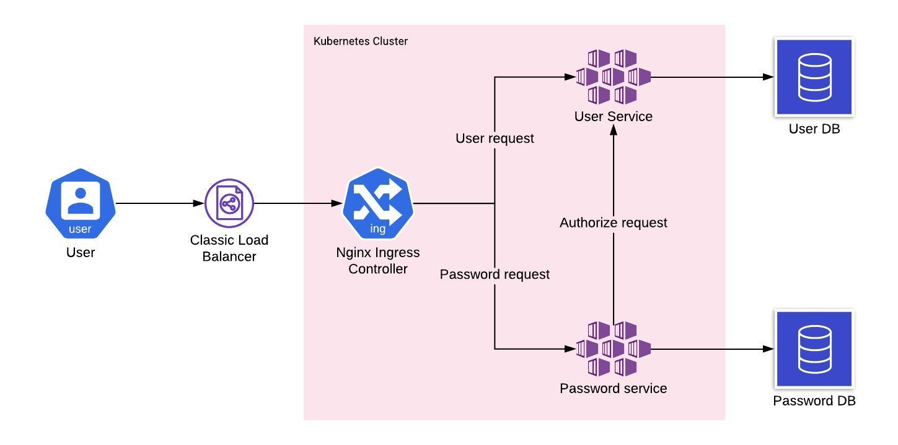

# Password Manager System
User can register and manage their password related credentials.

# Architecture

# Deploy
First of all you need to deploy the Database. For production it should be outside of the cluster and you need to define `Endpoints` to access outside database from inside of your cluster. [Please see my answer for details](https://stackoverflow.com/questions/54464722/calling-an-external-service-from-within-minikube/54465759#54465759).

I have write Makefile so you can deploy each service with a single `make deploy` command for the service directory. Before deploy you have to build docker image and push it in docker repository. I have used my dockerhub profile for this, you can change the docker tag and repository to your own. To deploy user service go to user service directory and run `make deploy`. To deploy password service go to password service directory and run `make deploy`

To clean up use `make delete` command.

After deploying services you need to deploy nginx ingres controller to redirect traffice to the specific service. You can find `ingress.yaml` file in the `root/deployment` directory. Before deploymeing ingress controller you need to deploy few mandatory dependencies and it varies from environement to environment. You can find you environment specific instractions [here](https://github.com/kubernetes/ingress-nginx/blob/master/docs/deploy/index.md#detect-installed-version).

# API
Import this link in postman and update `host` environment varibale with our cluster ip.
https://www.getpostman.com/collections/df770a89d79214e6909a
